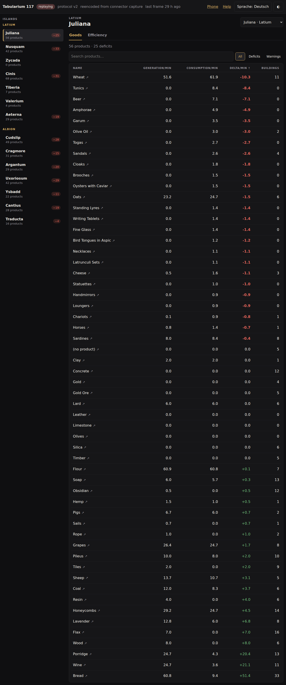
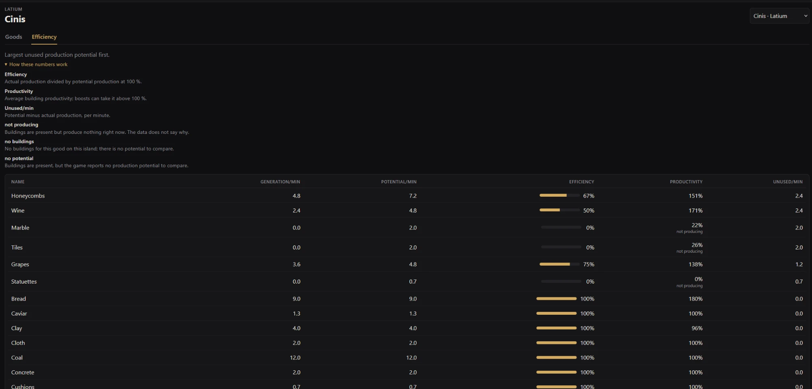
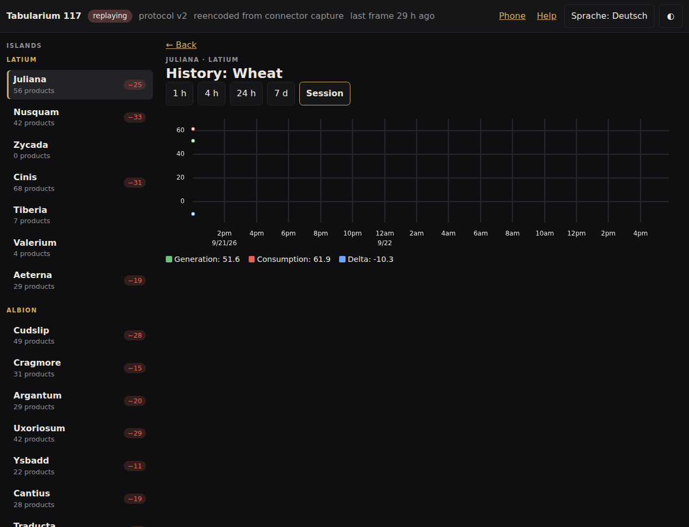
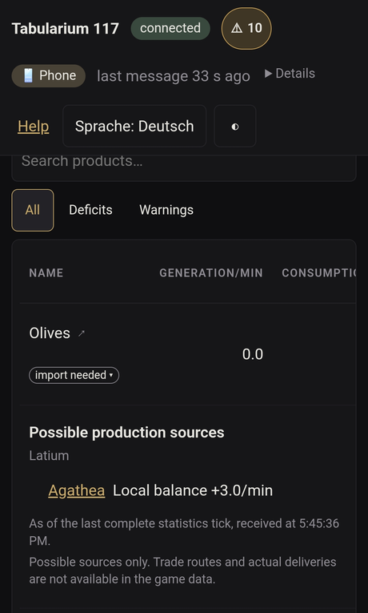

# Tabularium 117

[Deutsch](#deutsch) · [English](#english)

[](https://github.com/Dealwatch/Tabularium117/actions/workflows/ci.yml)
[](LICENSE)
[](https://ko-fi.com/dealwatch)

> **Status: Beta.** Tabularium 117 läuft gegen das echte Spiel und geht
> gerade in den Test mit den ersten Spielern. Es kann also noch rumpeln –
> Fehlerberichte sind ausdrücklich erwünscht (siehe `docs/beta.md`). Die
> aktuelle Beta gibt es auf der
> [Release-Seite](https://github.com/Dealwatch/Tabularium117/releases).
> Konzept: `KONZEPT.md`, Pipe-Protokoll: `docs/protocol.md`.
>
> **Status: beta.** Tabularium 117 runs against the real game and is going
> into testing with its first players, so expect rough edges – bug reports
> are explicitly welcome (see `docs/beta.md`). The current beta is available
> on the [releases page](https://github.com/Dealwatch/Tabularium117/releases).

---

## Deutsch

Ein kostenloses Open-Source-Tool, das die inoffizielle Pipe-Schnittstelle von
Anno 117 liest, eine Historie führt und die Wirtschaftsdaten live im Browser
zeigt – auf dem PC oder auf dem Handy im selben Netzwerk. Herunterladen,
Doppelklick, läuft: kein Build, kein Docker, keine Mod, streng read-only
gegenüber dem Spiel.

### Was es kann

1. **Live-Übersicht pro Insel** – alle Waren mit Produktion, Verbrauch und
   Delta; Defizite stehen oben und sind rot markiert.
2. **Verlauf pro Ware** – Diagramm der letzten 1 h, 4 h, 24 h, 7 Tage oder der
   ganzen Session für Produktion, Verbrauch und Delta.
3. **Effizienz-Ansicht** – Ist-Produktion gegen die theoretisch perfekte
   Produktion je Ware, dazu die mittlere Produktivität der Gebäude, um zu
   sehen, welche Kette unter ihrem Potenzial läuft.
4. **Warnungen** – regelbasiert: ein anhaltendes Defizit oder ein Einbruch der
   Effizienz wird in der UI angezeigt (optional mit Browser-Benachrichtigung
   oder Ton, standardmäßig aus).
5. **Handy-Modus** – per Schalter im UI einschaltbar, zeigt einen QR-Code mit
   der Adresse im eigenen Netzwerk.






*Die Screenshots zeigen wiedergegebene Beispieldaten aus einem Mitschnitt
(`testdata/connector-reencoded.jsonl`), kein Live-Spiel.*

### Schnellstart

1. `tabularium117.exe` vom [GitHub-Release](https://github.com/Dealwatch/Tabularium117/releases)
   herunterladen.
2. Prüfsumme kontrollieren: Im Release liegt eine `SHA256SUMS`-Datei. In
   PowerShell:
   ```powershell
   Get-FileHash .\tabularium117.exe -Algorithm SHA256
   ```
   Der Wert muss mit der Zeile zu `tabularium117.exe` in `SHA256SUMS` übereinstimmen.
3. `tabularium117.exe` starten. Der Browser öffnet automatisch
   `http://127.0.0.1:53118/`.

**Beta-Tester:** siehe `docs/beta.md` für eine ausführliche Anleitung und
Test-Checkliste.

**SmartScreen-Warnung:** Windows zeigt beim ersten Start „Windows hat den
Start dieser App verhindert“ – das liegt daran, dass `tabularium117.exe` ein
unsigniertes Open-Source-Binary ist, keine kommerzielle Codesignatur besitzt
und Windows sie deshalb noch nicht kennt. Auf **„Weitere Informationen“** und
dann **„Trotzdem ausführen“** klicken. Der Quellcode liegt hier im Repository,
und der Build ist mit `make build` reproduzierbar – jeder kann nachbauen und
vergleichen.

### Pipe aktivieren

Anno 117 braucht den Startparameter `/pipe`, sonst gibt es nichts zu lesen:

- **Steam:** Bibliothek → Rechtsklick auf Anno 117 → Eigenschaften →
  Allgemein → im Feld **Startoptionen** `/pipe` eintragen.
- **Ubisoft Connect:** Rechtsklick auf das Spiel → Eigenschaften →
  „Startargumente hinzufügen“ → `/pipe` eintragen.

Das Spiel muss laufen und ein
Savegame geladen haben; Tabularium 117 verbindet sich automatisch, sobald die Pipe
existiert, und versucht es weiter, falls sie (noch) fehlt. Die Pipe ist eine
von Ubisoft nicht offiziell unterstützte „Easter-Egg“-Schnittstelle – Details
und offene Fragen dazu stehen in `docs/protocol.md`.

### Handy-Modus

Auf dem PC oben rechts auf „Handy“ klicken und den Schalter „Für mein Netzwerk
freigeben“ einschalten. Tabularium 117 zeigt dann einen QR-Code; mit der
Handykamera scannen, während sich Handy und PC im selben WLAN befinden. Die
Adresse enthält einen Zugriffscode, der bei jedem Programmstart neu ist –
läuft Tabularium 117 neu, muss der QR-Code erneut gescannt werden. Nur Geräte im
eigenen privaten Netzwerk (10.x, 172.16–31.x, 192.168.x) können sich
verbinden. Zwei Komfortfunktionen fehlen auf dem Handy: Browser erlauben
Systembenachrichtigungen und das Anlassen des Bildschirms nur über eine
sichere Verbindung, und der Handy-Modus läuft über einfaches HTTP im eigenen
Netz. Auf dem PC unter `127.0.0.1` funktionieren beide; die Oberfläche sagt
auf dem Handy, warum sie ausgegraut sind. Beim ersten Mal fragt die Windows-Firewall, ob Tabularium 117 im
Netzwerk kommunizieren darf: dort **„Private Netzwerke“** wählen, nicht
„Öffentliche Netzwerke“. Nichts verlässt das eigene Netzwerk.

### Datenschutz

Alles bleibt auf dem eigenen PC (und, im Handy-Modus, im eigenen LAN). Die
Verlaufsdatenbank liegt standardmäßig unter
`%LOCALAPPDATA%\Tabularium117\tabularium117.db`; mit `--data-dir <pfad>` lässt sich ein
anderer Ort wählen. Sie hält 7 Tage in voller Auflösung, verdichtet danach auf
10-Minuten-Mittel und löscht nach 90 Tagen. Es gibt keine Telemetrie, keine
Update-Prüfung und keine Konten. Tabularium 117 liest die Pipe nur – es schreibt nie
etwas ins Spiel.

### Ressourcenbedarf

Tabularium 117 selbst braucht kaum Leistung. Gemessen über 5 Minuten,
während es mit einer laufenden Anno-117-Sitzung verbunden war, auf einem
Ryzen 7 9800X3D:

- **CPU:** im Schnitt 0,003 %, in der Spitze 0,098 %
- **Arbeitsspeicher:** 16,4 MB, im Schnitt wie in der Spitze

Gemessen wurde nur `tabularium117.exe`, nicht der Browser, der die Oberfläche
anzeigt – dessen Bedarf hängt vom Browser ab und davon, was sonst noch offen
ist. Auf anderer Hardware fallen die Werte anders aus. Dass sie so niedrig
sind, liegt an der Arbeitsweise: Das Spiel liefert etwa alle zwei Minuten
neue Statistiken, und dazwischen gibt es für Tabularium 117 so gut wie nichts
zu tun.

### Prometheus und Grafana (optional, experimentell)

**Für die normale Nutzung braucht es weder Prometheus noch Grafana** – dieser
Abschnitt ist nur für alle, die beides ohnehin betreiben und ihre Wirtschaft
über Wochen in eigenen Dashboards verfolgen wollen.

Tabularium 117 stellt den Live-Zustand unter `http://127.0.0.1:53118/metrics`
im Prometheus-Textformat bereit: Verbindung, Inseln sowie Produktion,
Verbrauch, Bilanz, Potenzial und Gebäudezahl je Ware und Insel. Er kostet
nichts, solange ihn niemand abfragt.

**Nur über Loopback:** `/metrics` antwortet derzeit ausschließlich auf
`127.0.0.1`, nie über den Handy-Modus. Prometheus muss deshalb auf **demselben
Windows-PC** laufen wie Tabularium 117. Ein Prometheus auf einem anderen
Rechner (etwa im Homelab) oder in einem Container kann `127.0.0.1:53118` nicht
direkt abfragen – für ihn wäre das seine eigene Loopback-Adresse, nicht die
des Spiele-PCs. Minimale Prometheus-Konfiguration auf dem Spiele-PC:

```yaml
scrape_configs:
  - job_name: tabularium117
    static_configs:
      - targets: ['127.0.0.1:53118']
```

Namen stehen nur in `tabularium117_island_info` und
`tabularium117_product_info` (immer englisch); in Abfragen werden sie über die
GUID dazugeholt, z. B.
`tabularium117_product_balance_per_minute * on (product_guid) group_left (product_name) tabularium117_product_info`.
Benennt man eine Insel um, ändert sich nur diese Info-Zeile; die Werte laufen
ohne Unterbrechung weiter. Umlaute liefert das Spiel als `_`.

**Fertiges Dashboard:** [`docs/grafana/tabularium117.json`](docs/grafana/tabularium117.json)
zeigt Verbindung, aktuelle Defizite, Bilanz und Effizienz über die Zeit sowie
alle Waren auf einen Blick, auswählbar nach Session, Insel und Ware. Import in
Grafana (10 oder neuer): *Dashboards → New → Import*, die Datei hochladen und
die Prometheus-Datenquelle wählen. Die Session ist eine Einzelauswahl, weil
Insel-Nummern sich zwischen Sessions wiederholen.

**Einschränkung – Spielstände sind nicht unterscheidbar:** Die Pipe liefert
keine Kennung für den Spielstand. `session_guid` bezeichnet die Region (z. B.
Latium), die in jedem Spielstand dieselbe ist, und `island_id` ist eine kleine
Zahl (0–255), die ein anderer Spielstand ebenso vergeben kann. Wer zwischen
Spielständen wechselt, bekommt deshalb unter Umständen dieselben Zeitreihen, die dann nahtlos von einem
Spielstand in den anderen übergehen. Wer mehrere Spielstände getrennt
auswerten will, muss sie in Prometheus selbst auseinanderhalten, etwa über
den Zeitraum.

Die vollständige Liste steht in `KONZEPT.md`, Abschnitt 5. Die Metriken sind
experimentell: Namen und Labels können sich bis Version 1.0 noch ändern.

### Kommandozeilen-Referenz

| Flag | Standard | Bedeutung |
|---|---|---|
| `--replay <datei>` | – | JSONL-Mitschnitt statt der echten Pipe wiedergeben |
| `--replay-speed <faktor>` | `1` | Wiedergabegeschwindigkeit; `0` so schnell wie möglich |
| `--replay-loop` | `false` | Mitschnitt am Ende von vorn beginnen |
| `--record <datei>` | – | jeden Rohframe in diese JSONL-Datei schreiben (angelegt/geleert) |
| `--anonymize-recording <datei>` | – | Mitschnitt ohne Profilnamen neu schreiben und beenden; startet weder Server noch Pipe |
| `--out <datei>` | `<eingabe>.anon.jsonl` | Ziel von `--anonymize-recording` |
| `--anonymize-islands` | `false` | `--anonymize-recording` ersetzt zusätzlich jeden Inselnamen durch `Island <sessionGUID>-<islandID>` |
| `--port <zahl>` | `53118` | HTTP-Port auf `127.0.0.1`; `0` wählt einen freien Port |
| `--data-dir <pfad>` | Anwendungsdaten des Benutzers | Verzeichnis für die eigenen Dateien von Tabularium 117 |
| `--no-browser` | `false` | beim Start keinen Browser öffnen |
| `--lan` | `false` | zusätzlich eine private LAN-Adresse freigeben (geschützt durch Zugriffscode) |
| `--lan-ip <ip>` | automatische Wahl | zu bindende LAN-Adresse; muss eine RFC-1918-Adresse dieses PCs sein |
| `--lan-allow-loopback` | `false` | **Testhilfe:** erlaubt `--lan-ip` eine Loopback-Adresse (nur von diesem PC erreichbar) |
| `--serve-after-replay` | `false` | nach Ende eines Mitschnitts weiter bedienen, bis Strg+C |
| `--no-db` | `false` | keine Verlaufsdatenbank führen, nur Live-Daten zeigen |
| `--alert-deficit-samples <n>` | `3` | Defizit-Warnung nach so vielen aufeinanderfolgenden Messungen mit negativem Delta |
| `--alert-drop-pp <n>` | `20` | Effizienz-Warnung, wenn die Effizienz um so viele Prozentpunkte unter ihr 15-Minuten-Mittel fällt (≈ 7 Statistik-Ticks) |
| `--verbose` | `false` | auf Debug-Ebene loggen |
| `--version` | – | Version ausgeben und beenden |

### Abgrenzung zu anderen Tools

| Projekt | Was es macht | Was Tabularium 117 anders macht |
|---|---|---|
| `UbisoftMainzAnno/anno117_pipe_example` | Rohdaten in einem ImGui-Fenster | Namen, Auswertung, Verlauf, Web-UI |
| `anno-mods/anno117-game-connector` | Pipe → SSE auf localhost, bettet den Calculator ein | Fertige .exe, LAN/Handy-Modus, Verlauf, Warnungen |
| `anno-mods/anno-117-calculator` | Planungstool mit manueller Eingabe | Tabularium 117 plant nicht, es zeigt den Ist-Zustand aus dem laufenden Spiel |
| `knakeyar/anno-117-companion` | Lua-Mod + Log + Docker, sehr umfangreich | keine Mod, kein Docker, bewusst schlank |

**Nicht-Ziele:** kein Produktionsketten-Planer, kein Handelsrouten-Planer, kein
KI-Berater, kein Cloud-Dienst, keine Konten, keine Mod-Installation und kein
Eingriff ins Spiel.

### Problembehandlung

- **„Warte auf Anno 117“ bleibt stehen:** Läuft das Spiel? Ist es mit `/pipe`
  gestartet (siehe oben)? Ist ein Savegame geladen?
- **Port bereits belegt:** einen anderen Port mit `--port <zahl>` wählen.
- **„Unbekannte Protokollversion“:** vermutlich hat ein Spiel-Patch das
  Format geändert. Bitte mit `--record mitschnitt.jsonl` einen Mitschnitt
  anfertigen und ihn an ein neues Issue anhängen – vorher am besten mit
  `--anonymize-recording mitschnitt.jsonl` den Profilnamen entfernen.
- **Namen wie `#123456` statt echter Namen:** der eingebaute Katalog kennt
  diese GUID noch nicht (z. B. nach einem Spiel-Patch mit neuen Inhalten);
  ein Issue hilft, den Katalog zu aktualisieren.
- **Handy verbindet sich nicht:** Sind Handy und PC im selben Netzwerk? Ist
  das Netzwerk auf dem PC als „Privat“ eingestuft? Hat die Windows-Firewall
  beim ersten Mal „Private Netzwerke“ erlaubt?

### Unterstützen

Tabularium 117 ist kostenlos und bleibt es: keine Bezahlfunktionen, keine
Werbung, kein Konto. Wer die Entwicklung trotzdem unterstützen möchte, kann
das auf [Ko-fi](https://ko-fi.com/dealwatch) tun – freiwillig, und ohne dass
sich am Programm irgendetwas ändert.

Im Programm selbst ist davon nichts zu sehen: Tabularium 117 bindet kein
Spenden-Widget ein, lädt nichts nach und ruft nirgendwo an (siehe
„Datenschutz“). Der Link steht hier und auf der Projektseite, sonst nirgends.

### Credits

- Ubisofts Pipe-Beispiel (`UbisoftMainzAnno/anno117_pipe_example`) für das
  Protokollwissen.
- `anno-mods/anno117-game-connector` für zusätzliches Protokollwissen und
  Test-Fixtures.
- `anno-mods/anno-117-calculator` (gepinnte Revision) für Spielnamen und
  GUID-Zuordnung.
- [uPlot](https://github.com/leeoniya/uPlot), [go-winio](https://github.com/Microsoft/go-winio),
  [modernc.org/sqlite](https://gitlab.com/cznic/sqlite), [go-qrcode](https://github.com/skip2/go-qrcode).

Vollständige Lizenztexte und Details: `THIRD_PARTY_NOTICES.md`.

*Anno 117: Pax Romana ist eine Marke von Ubisoft. Dies ist ein inoffizielles,
von der Community erstelltes Fan-Tool.*

---

## English

A free, open-source tool that reads Anno 117's unofficial pipe interface,
keeps a history, and shows the economy data live in a browser – on your PC or
on your phone in the same network. Download, double-click, run: no build
step, no Docker, no mod, strictly read-only towards the game.

### What it does

1. **Live overview per island** – every good with production, consumption,
   and delta; deficits sort to the top and are marked in red.
2. **History per good** – a chart of the last 1 h, 4 h, 24 h, 7 days, or the
   whole session for production, consumption, and delta.
3. **Efficiency view** – actual production against the theoretical perfect
   production for each good, plus the average productivity of its buildings,
   to spot which chain runs below its potential.
4. **Alerts** – rule-based: a lasting deficit or a drop in efficiency shows
   up in the UI (optionally with a browser notification or sound, off by
   default).
5. **Phone mode** – a switch in the UI shows a QR code with the address on
   your own network.


*The screenshots show replayed sample data from a recording
(`testdata/connector-reencoded.jsonl`), not a live game.*

### Quick start

1. Download `tabularium117.exe` from the [GitHub release](https://github.com/Dealwatch/Tabularium117/releases).
2. Verify the checksum: the release includes a `SHA256SUMS` file. In
   PowerShell:
   ```powershell
   Get-FileHash .\tabularium117.exe -Algorithm SHA256
   ```
   The value must match the `tabularium117.exe` line in `SHA256SUMS`.
3. Start `tabularium117.exe`. Your browser opens automatically at
   `http://127.0.0.1:53118/`.

**Beta testers:** see `docs/beta.md` for a full guide and test checklist.

**SmartScreen warning:** on first run, Windows shows "Windows protected your
PC" because `tabularium117.exe` is an unsigned open-source binary without a
commercial code-signing certificate, so Windows does not yet recognize it.
Click **"More info"**, then **"Run anyway"**. The source is right here in
this repository, and the build is reproducible with `make build`, so anyone
can rebuild it and compare.

### Enable the pipe

Anno 117 needs the `/pipe` launch argument, or there is nothing to read:

- **Steam:** Library → right-click Anno 117 → Properties → General → enter
  `/pipe` in the **Launch Options** field.
- **Ubisoft Connect:** right-click the game → Properties → "Add launch
  arguments" → enter `/pipe`.

The game must be running with a savegame loaded; Tabularium 117
connects automatically once the pipe exists, and keeps retrying if it is
missing (yet). The pipe is an "easter egg" interface that Ubisoft does not
officially support – details and open questions are in `docs/protocol.md`.

### Phone mode

On the PC, open "Phone" in the top right and turn on "Share with my
network". Tabularium 117 then shows a QR code; scan it with your phone's camera
while both devices are on the same Wi-Fi. The address carries an access
token that is new every time the program starts – restart Tabularium 117, and the
QR code needs to be scanned again. Only devices on your own private network
(10.x, 172.16-31.x, 192.168.x) can connect. Two comforts are missing on the
phone: browsers only allow system notifications and keeping the screen on
over a secure connection, and phone mode is plain HTTP inside your own
network. Both work on the PC at `127.0.0.1`, and the UI says on the phone why
they are greyed out. The first time, the Windows
firewall asks whether Tabularium 117 may communicate on the network: choose
**"Private networks"**, not "Public networks". Nothing leaves your own
network.

### Privacy

Everything stays on your PC (and, in phone mode, on your own LAN). The
history database lives at `%LOCALAPPDATA%\Tabularium117\tabularium117.db` by default;
use `--data-dir <path>` to pick another location. It keeps 7 days at full
resolution, then 10-minute means, and deletes them after 90 days. There is no
telemetry, no update check, and no accounts. Tabularium 117 only reads the pipe – it
never writes anything into the game.

### Resource usage

Tabularium 117 itself needs next to nothing. Measured over 5 minutes while
connected to a running Anno 117 session, on a Ryzen 7 9800X3D:

- **CPU:** 0.003 % on average, 0.098 % at peak
- **Memory:** 16.4 MB, both on average and at peak

This measures `tabularium117.exe` only, not the browser that shows the UI –
that depends on which browser you use and what else is open. Other hardware
gives other numbers. They are this low because of how the work arrives: the
game sends new statistics about every two minutes, and in between there is
almost nothing for Tabularium 117 to do.

### Prometheus and Grafana (optional, experimental)

**Normal use needs neither Prometheus nor Grafana** – this section is only for
people who already run both and want to follow their economy over weeks in
their own dashboards.

Tabularium 117 serves the live state at `http://127.0.0.1:53118/metrics` in the
Prometheus text format: the connection, the islands, and production,
consumption, balance, potential and building count per good and island. It
costs nothing while nobody scrapes it.

**Loopback only:** `/metrics` currently answers on `127.0.0.1` only, never
through phone mode. Prometheus therefore has to run on the **same Windows PC**
as Tabularium 117. A Prometheus on another machine (say, in a homelab) or in a
container cannot scrape `127.0.0.1:53118` directly – to it, that is its own
loopback address, not the gaming PC's. A minimal Prometheus configuration on
the gaming PC:

```yaml
scrape_configs:
  - job_name: tabularium117
    static_configs:
      - targets: ['127.0.0.1:53118']
```

Names appear only in `tabularium117_island_info` and
`tabularium117_product_info` (always English); queries join them in by GUID,
e.g.
`tabularium117_product_balance_per_minute * on (product_guid) group_left (product_name) tabularium117_product_info`.
Renaming an island changes only that info line; the values carry on without
a break. The game sends umlauts as `_`.

**Ready-made dashboard:** [`docs/grafana/tabularium117.json`](docs/grafana/tabularium117.json)
shows the connection, the current deficits, balance and efficiency over time
and every good at a glance, filterable by session, island and good. To import
it in Grafana (10 or newer): *Dashboards → New → Import*, upload the file and
pick the Prometheus data source. The session is a single choice because
island numbers repeat between sessions.

**Limitation – saves cannot be told apart:** the pipe provides no identifier
for the save. `session_guid` names the region (e.g. Latium), which is the same
in every save, and `island_id` is a small number (0–255) that another save
can hand out just as well. Switching between saves can therefore produce the same time series, running seamlessly from one save
into the other. To analyse several saves separately, tell them apart in
Prometheus yourself, for example by time range.

The full list is in `KONZEPT.md`, section 5. The metrics are experimental:
names and labels may still change before version 1.0.

### Command-line reference

| Flag | Default | Meaning |
|---|---|---|
| `--replay <file>` | – | replay this JSONL recording instead of the real pipe |
| `--replay-speed <factor>` | `1` | replay speed factor; `0` replays as fast as possible |
| `--replay-loop` | `false` | start the recording over when it ends |
| `--record <file>` | – | write every raw frame to this JSONL file (created or truncated) |
| `--anonymize-recording <file>` | – | rewrite a recording without the profile name in it and exit; starts neither the server nor the pipe |
| `--out <file>` | `<input>.anon.jsonl` | where `--anonymize-recording` writes its result |
| `--anonymize-islands` | `false` | `--anonymize-recording` also replaces every island name with `Island <sessionGUID>-<islandID>` |
| `--port <number>` | `53118` | HTTP port on `127.0.0.1`; `0` picks any free port |
| `--data-dir <path>` | per-user application data | directory for Tabularium 117's own files |
| `--no-browser` | `false` | do not open a browser on start |
| `--lan` | `false` | also serve one private LAN address, protected by an access token |
| `--lan-ip <ip>` | chosen automatically | LAN address to bind; must be an RFC 1918 address of this PC |
| `--lan-allow-loopback` | `false` | **test aid:** allow `--lan-ip` to name a loopback address (reachable from this PC only) |
| `--serve-after-replay` | `false` | keep serving after a replay has ended, until Ctrl+C |
| `--no-db` | `false` | do not keep a history database; show the live data only |
| `--alert-deficit-samples <n>` | `3` | raise a deficit warning after this many consecutive measurements with a negative delta |
| `--alert-drop-pp <n>` | `20` | raise a productivity warning when efficiency falls this many percentage points below its 15-minute mean (about 7 statistics ticks) |
| `--verbose` | `false` | log at debug level |
| `--version` | – | print the version and exit |

### Differences to other tools

| Project | What it does | What Tabularium 117 does differently |
|---|---|---|
| `UbisoftMainzAnno/anno117_pipe_example` | Raw data in an ImGui window | Names, analysis, history, web UI |
| `anno-mods/anno117-game-connector` | Pipe → SSE on localhost, embeds the calculator | A ready-made .exe, LAN/phone mode, history, alerts |
| `anno-mods/anno-117-calculator` | A planning tool with manual input | Tabularium 117 does not plan, it shows the current state from the running game |
| `knakeyar/anno-117-companion` | Lua mod + log + Docker, very extensive | No mod, no Docker, deliberately lean |

**Non-goals:** no production-chain planner, no trade-route planner, no AI
advisor, no cloud service, no accounts, no mod installation, and no
interference with the game.

### Troubleshooting

- **"Waiting for Anno 117" stays on screen:** Is the game running? Was it
  launched with `/pipe` (see above)? Is a savegame loaded?
- **Port already in use:** pick a different one with `--port <number>`.
- **"Unknown protocol version":** a game patch likely changed the format.
  Please record a capture with `--record recording.jsonl` and attach it to a
  new issue – ideally after removing the profile name with
  `--anonymize-recording recording.jsonl`.
- **Names like `#123456` instead of real names:** the bundled catalog does
  not know this GUID yet (for example after a game patch added new content);
  an issue helps get the catalog updated.
- **Phone cannot connect:** Are the phone and the PC on the same network? Is
  the network set to "Private" on the PC? Did the Windows firewall prompt
  allow "Private networks" the first time?

### Support the project

Tabularium 117 is free and stays free: no paid features, no ads, no account.
If you would like to support its development anyway, you can do so on
[Ko-fi](https://ko-fi.com/dealwatch) – entirely optional, and nothing about
the program changes either way.

None of it shows up in the program: Tabularium 117 embeds no donation widget,
loads nothing from anywhere, and phones nowhere home (see "Privacy"). The
link lives here and on the project page, nowhere else.

### Credits

- Ubisoft's pipe example (`UbisoftMainzAnno/anno117_pipe_example`) for the
  protocol knowledge.
- `anno-mods/anno117-game-connector` for additional protocol knowledge and
  test fixtures.
- `anno-mods/anno-117-calculator` (pinned revision) for game names and GUID
  mapping.
- [uPlot](https://github.com/leeoniya/uPlot), [go-winio](https://github.com/Microsoft/go-winio),
  [modernc.org/sqlite](https://gitlab.com/cznic/sqlite), [go-qrcode](https://github.com/skip2/go-qrcode).

Full license texts and details: `THIRD_PARTY_NOTICES.md`.

*Anno 117: Pax Romana is a trademark of Ubisoft. This is an unofficial,
community-made fan tool.*

---

## Entwicklung / Development

Requires Go 1.25+ (`go.mod`; an older `go` downloads it via `GOTOOLCHAIN=auto`). Code, comments, and commit messages are English; user-facing
documentation is German and English.

```sh
./scripts/check.sh   # gofmt, go vet, go test
make build           # cross-compiles dist/tabularium117.exe (windows/amd64)
make build-host      # binary for the current platform
```

On Windows without `make`, `build.ps1` produces the same `dist/tabularium117.exe`.

Ohne laufendes Spiel (und auf Linux) arbeitet Tabularium 117 aus einem Mitschnitt; der
Befehl gibt die Inseln und ihre Warenzahl aus. / Without a running game (and on
Linux) Tabularium 117 works from a recording; this command prints the islands and
their product counts:

```sh
go run ./cmd/tabularium117 --replay testdata/connector-reencoded.jsonl --replay-speed 0
```

`--record datei.jsonl` schreibt jede Rohnachricht mit; beides lässt sich
kombinieren. / `--record file.jsonl` records every raw frame; the two can be
combined.

Um die Oberfläche ohne laufendes Spiel anzusehen, den Server nach der
Wiedergabe offen halten: / To look at the UI without a running game, keep the
server open after the replay ends:

```sh
go run ./cmd/tabularium117 --replay testdata/connector-reencoded.jsonl --replay-speed 0 --serve-after-replay
```

UI und API laufen auf `http://127.0.0.1:53118/` (`--port`, `--port 0` nimmt
einen freien Port, `--no-browser` unterdrückt das Öffnen, `--serve-after-replay`
hält den Server nach einem Replay offen). / The UI and the API are served at
`http://127.0.0.1:53118/` (`--port`, with `--port 0` picking a free one,
`--no-browser` to skip opening a browser, `--serve-after-replay` to keep
serving once a replay has ended).

`--lan-allow-loopback` ist eine Testhilfe: zusammen mit `--lan-ip 127.0.0.x`
läuft der LAN-Pfad (Token, Client-Filter, QR-Code) gegen eine Loopback-Adresse,
die nur von diesem PC aus erreichbar ist. Sie öffnet nichts ins Netzwerk und
ist nur mit einer Loopback-`--lan-ip` gültig. / `--lan-allow-loopback` is a test
aid: together with `--lan-ip 127.0.0.x` it exercises the whole LAN path (token,
client filter, QR code) against a loopback address that is reachable from this
PC only. It opens nothing to the network and is rejected for any other address.

Weiterführende Dokumente / Further documents: `KONZEPT.md` (Konzept,
Architektur, Datenmodell, API), `docs/protocol.md` (Pipe-Protokoll), `docs/release.md` (Release-Checkliste),
`docs/beta.md` (Anleitung für Beta-Tester).

## Lizenz / License

MIT – siehe / see `LICENSE`. Spielinhalte und -daten sind © Ubisoft. / Game content and
data are © Ubisoft.
